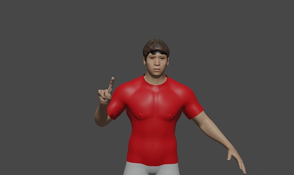
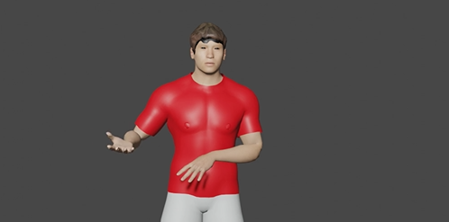

# 3D_Animated_Human_Modeling-Indian_Hand_Signs-Blender

In general, there are two ways that people communicate. These are verbal and non-verbal. The use of nonverbal communication influences all aspect of our daily life. In this method of communication, people talk to one another or express information by utilising their hands and bodies. The skill of body language and hand gestures must therefore be learned and understood.

We can utilise hand and body motions as useful tools to decode or interpret someone's mood or mental state at a certain time. The body language and hand gestures used in every nation on earth are unique to that nation. Here is a project using 3D Human modelling and animations (with the help of Blender) that depicts a few Indian hand signals along with their definitions.

Check out my project here: [Indian Sign Language](https://sprightly-cocada-e85e1a.netlify.app/)

&nbsp;

# Software and Tools Required

1. [Github Account](https://github.com)
2. [VSCode IDE](https://code.visualstudio.com/)
3. [blender](https://www.blender.org/download/)
4. [Make Human](http://www.makehumancommunity.org/content/downloads.html)

# Created and Maintained By

[Dev Divyendh D](https://github.com/Dev-Divyendh) 

